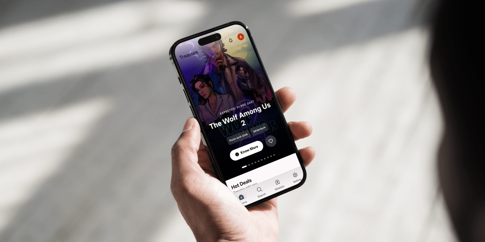
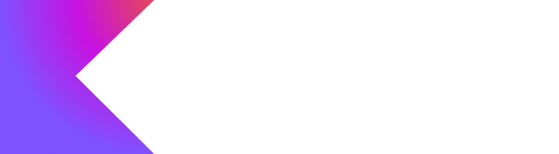
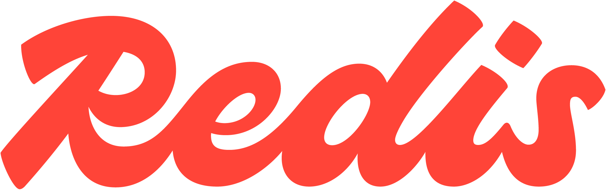
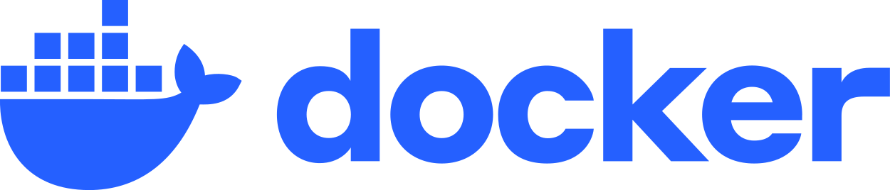
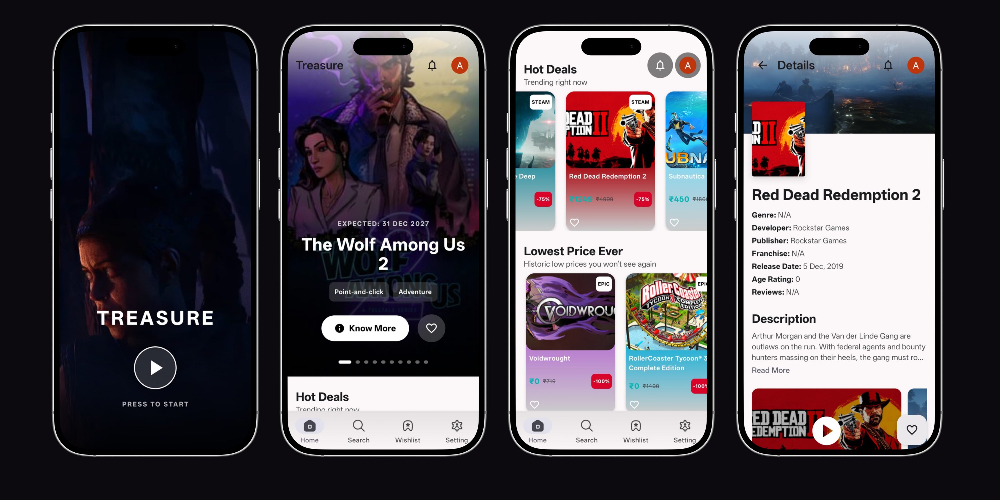
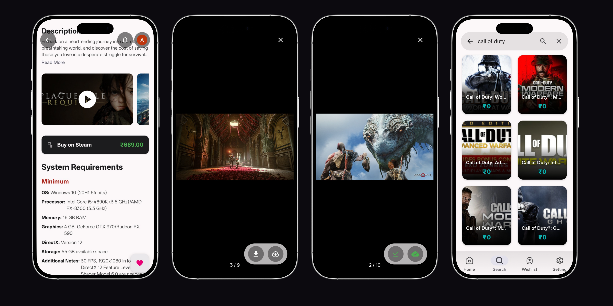
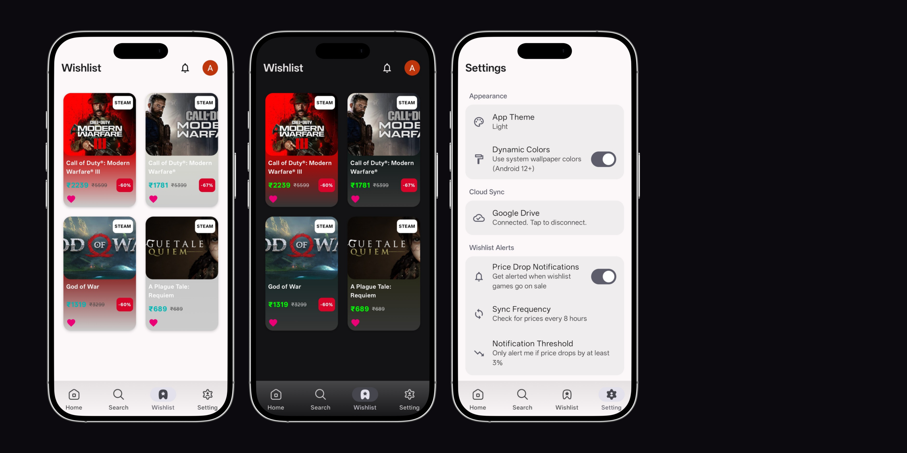
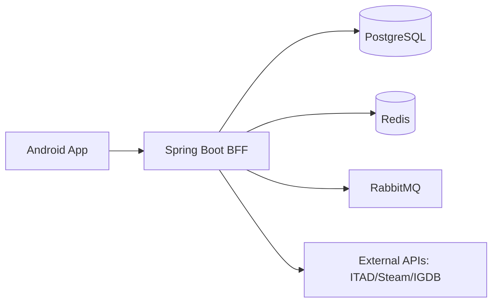

<p align="center">
  
</p>

<h1 align="center">🏴‍☠️ Treasure</h1>

<p align="center">
  <strong>The Ultimate Game Deal Tracker & Wishlist Companion</strong>
</p>

<p align="center">
  
  
  
  
</p>

---

## ✨ Overview

**Treasure** is a modern, high-performance game deal tracker designed for gamers who never want to miss a sale. By aggregating data from Steam, GOG, Epic Games, and more, Treasure provides a unified interface to discover "Hot Deals", "Historic Lows", and platform-specific bargains.

Built with **Jetpack Compose** on the front-end and a **Spring Boot BFF** on the back-end, it offers a seamless, offline-first experience with cloud synchronization via Google Drive.

---

## 📱 Features

- 🎯 **Deal Discovery**: Real-time tracking of platform-specific sales (Mac/Linux) and "Lowest Price Ever" alerts.
- 📺 **Immersive Media**: High-quality screenshots and trailers powered by **Media3 ExoPlayer**.
- 🔔 **Smart Alerts**: Customizable price-drop notifications so you buy only when the price is right.
- ☁️ **Cloud Sync**: Securely backup your wishlist using **Google Drive integration**.
- 🎨 **Material You**: Full **Material 3** implementation with **Dynamic Color** support.
- 🚀 **Performance**: Offline-first architecture with **Room DB** and **Paging 3**.

---

## 🛠 Tech Stack

### Frontend (Android)
<p align="left">
   &nbsp;
   &nbsp;
  
</p>

- **UI**: Jetpack Compose, Material 3, Motion Layout.
- **Architecture**: MVVM + Clean Architecture.
- **Data**: Room DB, DataStore, Paging 3.
- **Networking**: Retrofit 3.0, OkHttp 5.1, GSON.
- **Security**: Google Credential Manager, Security-Crypto.

### Backend (BFF)
<p align="left">
   &nbsp;
   &nbsp;
   &nbsp;
   &nbsp;
   &nbsp;
  
</p>

- **Core**: Spring Boot 3.2, Spring Security (JWT).
- **Data**: Spring Data JPA, Hibernate, PostgreSQL.
- **Caching & Messaging**: Redis, RabbitMQ.
- **DevOps**: Docker, AWS Elastic Beanstalk, Swagger/OpenAPI.

---

## 📸 Screenshots

<p align="center">
  
  
  
</p>

---

## 🏗 System Architecture



---

## 🚀 Getting Started

### Prerequisites
- **Android Studio Ladybug** (or newer)
- **JDK 17**
- A Google Cloud Project for Sign-In & Drive APIs.

### Installation
1. **Clone the repo**:
   ```bash
   git clone https://github.com/Arnab-Kumar-Jana/Treasure.git
   ```
2. **Setup Keys**: Create a `local.properties` file with your API keys.
3. **Build**: Sync Gradle and run the `:app` module.

---

## 📄 License

Distributed under the MIT License. See `LICENSE` for more information.

---

<p align="center">
  Developed with ❤️ by Arnab Kumar Jana
</p>
